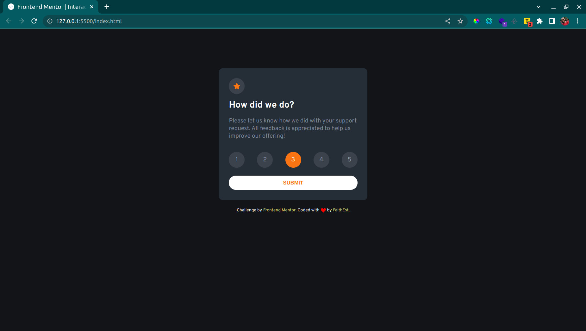

# Interactive rating component solution

This is a solution to the [Interactive rating component challenge on Frontend Mentor](https://www.frontendmentor.io/challenges/interactive-rating-component-koxpeBUmI). Frontend Mentor challenges help you improve your coding skills by building realistic projects.

## Table of contents

- [Overview](#overview)
  - [The challenge](#the-challenge)
  - [Screenshot](#screenshot)
- [My process](#my-process)
  - [Built with](#built-with)
  - [What I learned](#what-i-learned)
  - [Useful resources](#useful-resources)
- [Author](#author)

## Overview

### The challenge

Users should be able to:

- View the optimal layout for the app depending on their device's screen size
- See hover states for all interactive elements on the page
- Select and submit a number rating
- See the "Thank you" card state after submitting a rating

### Screenshot



## My process

### Built with

- Semantic HTML5 markup
- CSS custom properties
- Flexbox
- Mobile-first workflow
- Javascript

### What I learned

Forms are an essential part and make things easier since most things are already done for you. My biggest lesson was on customizing radio buttons using css; here's some css snippet

To see how you can add code snippets, see below:

```css
input[type="radio"] {
  background-color: rgb(255, 255, 255, 0.1);
  width: 40px;
  height: 40px;
  position: relative;
  border-radius: 50%;
  cursor: pointer;
  -webkit-appearance: none;
  appearance: none;
}
input[type="radio"]:hover {
  background-color: #959eac;
  color: white;
}
input[type="radio"]:focus {
  background-color: #fb7413;
}
input[type="radio"]:checked + span {
  color: white;
}
```

### Useful resources

- [Building customized radio buttons](https://moderncss.dev/pure-css-custom-styled-radio-buttons/)

## Author

FAITH MUTITU

- Frontend Mentor - [@FaithEst](https://www.frontendmentor.io/profile/FaithEst)
